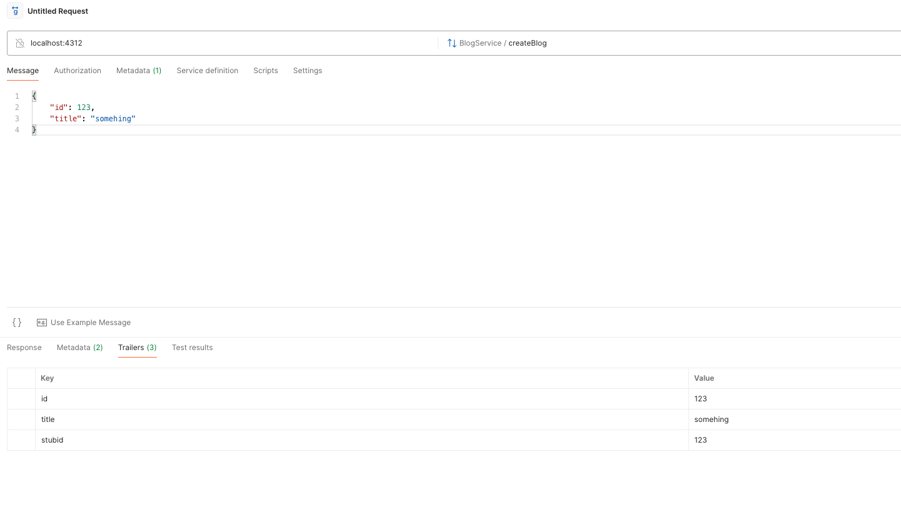

# XQ Stub Server

### Setup:

1. Make sure you have _node_ installed in your machine.
2. Run this command `npm install -g camouflage-server` in your terminal.
3. Run this command `npm install -g lowdb` in your terminal.
4. In this <root_dir>, run `camouflage -c config.yml`

### Now your server is started!

- REST server is up and running on port 8080

  Request to test stub definition

  ```
    curl --location 'localhost:8080/hello-world' \
      --header 'x-stub-id: bdd8b4a9-1de9-4496-a578-3ff68ae0d036' \
      --header 'Content-Type: application/json' \
      --data '{
      "nickname": ["david"]
      }'
  ```

  Request to query above recorded stub

  ```
    curl --location 'localhost:8080/stub?id=b9e8c849-87a0-4b7d-a9d1-4df041259ad7'
  ```

- GRPC server is up and running on port 4312

  > Currently there is a limitation of recording a stateful GRPC message into any database (lowDB in this case). But we can still use a trick to capture information in Grpc message and pass them to GRPC trailer, as below:

  Stub definition:

  ```
  {
      "id": {{num_between lower=500 upper=600}},
      "title": "something",
      "metadata": {
          "id": "{{capture using='jsonpath' selector='$.id'}}",
          "title": "{{capture using='jsonpath' selector='$.title'}}",
          "stubId": "{{capture from='metadata' key='x-stub-id'}}"
      }
  }
  ```

  
